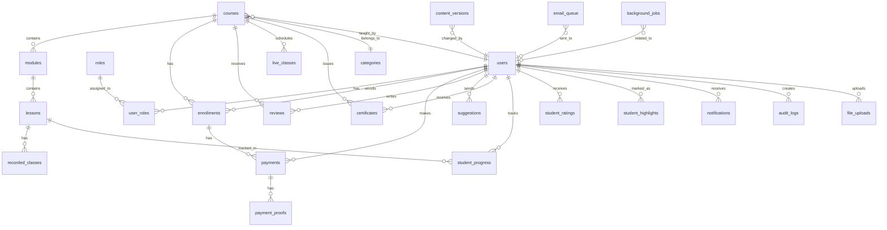

# 🗄️ Diseño de Base de Datos — CodeAcademy Pro

## Convenciones

- **Primary Keys**: UUID v4 (`gen_random_uuid()`)
- **Timestamps**: `created_at`, `updated_at` en todas las tablas
- **Soft Delete**: `deleted_at TIMESTAMP NULL` donde aplique
- **Naming**: snake_case para tablas y columnas
- **Foreign Keys**: Nomenclatura `fk_{tabla}_{columna}`
- **Índices**: Nomenclatura `idx_{tabla}_{columna(s)}`
- **Constraints**: Nomenclatura `chk_{tabla}_{condición}`

---

## Diagrama Entidad-Relación

---

## Tablas Detalladas (26 tablas)

### 1. `users` — Usuarios del sistema

| Columna | Tipo | Constraints | Descripción |
|---------|------|------------|-------------|
| `id` | UUID | PK, DEFAULT gen_random_uuid() | Identificador único |
| `email` | VARCHAR(255) | UNIQUE, NOT NULL | Email del usuario |
| `username` | VARCHAR(30) | UNIQUE, NOT NULL | Nombre de usuario |
| `password_hash` | VARCHAR(255) | NOT NULL | Hash bcrypt |
| `first_name` | VARCHAR(120) | NOT NULL | Nombre |
| `last_name` | VARCHAR(120) | NOT NULL | Apellido |
| `avatar_url` | VARCHAR(500) | NULL | URL de foto de perfil |
| `phone` | VARCHAR(20) | NULL | Teléfono |
| `bio` | TEXT | NULL | Biografía (docentes) |
| `is_active` | BOOLEAN | DEFAULT TRUE | Cuenta activa |
| `is_blocked` | BOOLEAN | DEFAULT FALSE | Cuenta bloqueada |
| `email_verified` | BOOLEAN | DEFAULT FALSE | Email verificado |
| `email_verification_token` | VARCHAR(255) | NULL | Token de verificación |
| `last_login_at` | TIMESTAMP | NULL | Último login |
| `created_at` | TIMESTAMP | DEFAULT NOW() | Fecha de creación |
| `updated_at` | TIMESTAMP | DEFAULT NOW() | Última actualización |
| `deleted_at` | TIMESTAMP | NULL | Soft delete |

### 2. `roles` — Roles del sistema

| Columna | Tipo | Constraints | Descripción |
|---------|------|------------|-------------|
| `id` | UUID | PK | Identificador |
| `name` | VARCHAR(50) | UNIQUE, NOT NULL | Nombre del rol (admin, teacher, student) |
| `description` | VARCHAR(255) | NULL | Descripción |
| `created_at` | TIMESTAMP | DEFAULT NOW() | Fecha creación |

### 3. `user_roles` — Asignación de roles a usuarios

| Columna | Tipo | Constraints | Descripción |
|---------|------|------------|-------------|
| `id` | UUID | PK | Identificador |
| `user_id` | UUID | FK → users(id), NOT NULL | Usuario |
| `role_id` | UUID | FK → roles(id), NOT NULL | Rol |
| `assigned_at` | TIMESTAMP | DEFAULT NOW() | Fecha asignación |
| | | UNIQUE(user_id, role_id) | Sin duplicados |

### 4. `categories` — Categorías de cursos

| Columna | Tipo | Constraints | Descripción |
|---------|------|------------|-------------|
| `id` | UUID | PK | Identificador |
| `name` | VARCHAR(100) | UNIQUE, NOT NULL | Nombre categoría |
| `slug` | VARCHAR(120) | UNIQUE, NOT NULL | Slug URL-friendly |
| `description` | TEXT | NULL | Descripción |
| `is_active` | BOOLEAN | DEFAULT TRUE | Activa |
| `sort_order` | INTEGER | DEFAULT 0 | Orden de visualización |
| `created_at` | TIMESTAMP | DEFAULT NOW() | |
| `updated_at` | TIMESTAMP | DEFAULT NOW() | |

### 5. `courses` — Cursos

| Columna | Tipo | Constraints | Descripción |
|---------|------|------------|-------------|
| `id` | UUID | PK | Identificador |
| `title` | VARCHAR(255) | NOT NULL | Título del curso |
| `slug` | VARCHAR(120) | UNIQUE, NOT NULL | Slug URL-friendly |
| `description` | TEXT | NOT NULL | Descripción completa |
| `short_description` | VARCHAR(500) | NULL | Descripción corta |
| `thumbnail_url` | VARCHAR(500) | NULL | Imagen del curso |
| `category_id` | UUID | FK → categories(id) | Categoría |
| `teacher_id` | UUID | FK → users(id), NOT NULL | Docente asignado |
| `price` | DECIMAL(10,2) | NOT NULL, CHECK >= 0 | Precio |
| `currency` | VARCHAR(3) | DEFAULT 'USD' | Moneda |
| `level` | VARCHAR(20) | CHECK IN (beginner, intermediate, advanced) | Nivel |
| `duration_hours` | INTEGER | NULL | Duración estimada |
| `is_active` | BOOLEAN | DEFAULT FALSE | Publicado/activo |
| `is_featured` | BOOLEAN | DEFAULT FALSE | Destacado |
| `max_students` | INTEGER | NULL | Máximo de alumnos (NULL = sin límite) |
| `starts_at` | TIMESTAMP | NULL | Fecha inicio |
| `ends_at` | TIMESTAMP | NULL | Fecha fin |
| `created_at` | TIMESTAMP | DEFAULT NOW() | |
| `updated_at` | TIMESTAMP | DEFAULT NOW() | |
| `deleted_at` | TIMESTAMP | NULL | Soft delete |

### 6. `modules` — Módulos de un curso

| Columna | Tipo | Constraints | Descripción |
|---------|------|------------|-------------|
| `id` | UUID | PK | Identificador |
| `course_id` | UUID | FK → courses(id), NOT NULL | Curso padre |
| `title` | VARCHAR(255) | NOT NULL | Título del módulo |
| `description` | TEXT | NULL | Descripción |
| `sort_order` | INTEGER | NOT NULL, DEFAULT 0 | Orden dentro del curso |
| `is_published` | BOOLEAN | DEFAULT FALSE | Visible para alumnos |
| `created_at` | TIMESTAMP | DEFAULT NOW() | |
| `updated_at` | TIMESTAMP | DEFAULT NOW() | |

### 7. `lessons` — Lecciones dentro de un módulo

| Columna | Tipo | Constraints | Descripción |
|---------|------|------------|-------------|
| `id` | UUID | PK | Identificador |
| `module_id` | UUID | FK → modules(id), NOT NULL | Módulo padre |
| `title` | VARCHAR(255) | NOT NULL | Título |
| `description` | TEXT | NULL | Descripción |
| `content` | TEXT | NULL | Contenido text/markdown |
| `sort_order` | INTEGER | NOT NULL, DEFAULT 0 | Orden |
| `duration_minutes` | INTEGER | NULL | Duración estimada |
| `is_free` | BOOLEAN | DEFAULT FALSE | Preview gratuito |
| `is_published` | BOOLEAN | DEFAULT FALSE | Visible |
| `created_at` | TIMESTAMP | DEFAULT NOW() | |
| `updated_at` | TIMESTAMP | DEFAULT NOW() | |

### 8. `live_classes` — Clases en vivo

| Columna | Tipo | Constraints | Descripción |
|---------|------|------------|-------------|
| `id` | UUID | PK | Identificador |
| `course_id` | UUID | FK → courses(id), NOT NULL | Curso |
| `title` | VARCHAR(255) | NOT NULL | Título de la sesión |
| `description` | TEXT | NULL | Descripción |
| `meeting_url` | VARCHAR(500) | NOT NULL | Link de la reunión (Zoom/Meet/etc) |
| `meeting_platform` | VARCHAR(50) | NULL | Plataforma (zoom, meet, teams) |
| `scheduled_at` | TIMESTAMP | NOT NULL | Fecha/hora programada |
| `duration_minutes` | INTEGER | DEFAULT 60 | Duración estimada |
| `is_recorded` | BOOLEAN | DEFAULT FALSE | Se grabará |
| `recording_url` | VARCHAR(500) | NULL | URL de grabación posterior |
| `status` | VARCHAR(20) | DEFAULT 'scheduled' | scheduled, live, completed, cancelled |
| `created_at` | TIMESTAMP | DEFAULT NOW() | |
| `updated_at` | TIMESTAMP | DEFAULT NOW() | |

### 9. `recorded_classes` — Clases grabadas

| Columna | Tipo | Constraints | Descripción |
|---------|------|------------|-------------|
| `id` | UUID | PK | Identificador |
| `lesson_id` | UUID | FK → lessons(id), NOT NULL | Lección asociada |
| `title` | VARCHAR(255) | NOT NULL | Título del video |
| `video_url` | VARCHAR(500) | NOT NULL | URL del video |
| `video_provider` | VARCHAR(50) | DEFAULT 'storage' | storage, youtube, vimeo |
| `duration_minutes` | INTEGER | NULL | Duración |
| `thumbnail_url` | VARCHAR(500) | NULL | Thumbnail |
| `sort_order` | INTEGER | DEFAULT 0 | Orden |
| `is_published` | BOOLEAN | DEFAULT TRUE | Visible |
| `created_at` | TIMESTAMP | DEFAULT NOW() | |
| `updated_at` | TIMESTAMP | DEFAULT NOW() | |

### 10. `enrollments` — Inscripciones

| Columna | Tipo | Constraints | Descripción |
|---------|------|------------|-------------|
| `id` | UUID | PK | Identificador |
| `student_id` | UUID | FK → users(id), NOT NULL | Alumno |
| `course_id` | UUID | FK → courses(id), NOT NULL | Curso |
| `status` | VARCHAR(30) | NOT NULL, DEFAULT 'pending_payment' | Estado de inscripción |
| `enrolled_at` | TIMESTAMP | DEFAULT NOW() | Fecha inscripción |
| `approved_at` | TIMESTAMP | NULL | Fecha aprobación |
| `cancelled_at` | TIMESTAMP | NULL | Fecha cancelación |
| `cancellation_reason` | TEXT | NULL | Motivo cancelación |
| `completed_at` | TIMESTAMP | NULL | Fecha completado |
| `progress_percentage` | DECIMAL(5,2) | DEFAULT 0.00 | Progreso % |
| `created_at` | TIMESTAMP | DEFAULT NOW() | |
| `updated_at` | TIMESTAMP | DEFAULT NOW() | |
| | | UNIQUE(student_id, course_id) | Sin duplicados |

**Estados válidos**: `pending_payment`, `payment_pending_review`, `payment_approved`, `payment_rejected`, `active`, `cancelled`, `completed`, `expired`

### 11. `payments` — Pagos

| Columna | Tipo | Constraints | Descripción |
|---------|------|------------|-------------|
| `id` | UUID | PK | Identificador |
| `enrollment_id` | UUID | FK → enrollments(id), NOT NULL | Inscripción |
| `student_id` | UUID | FK → users(id), NOT NULL | Alumno |
| `amount` | DECIMAL(10,2) | NOT NULL, CHECK > 0 | Monto |
| `currency` | VARCHAR(3) | DEFAULT 'USD' | Moneda |
| `payment_method` | VARCHAR(50) | DEFAULT 'bank_transfer' | Método |
| `status` | VARCHAR(30) | NOT NULL, DEFAULT 'pending' | Estado |
| `reference_number` | VARCHAR(100) | NULL | Referencia bancaria |
| `reviewed_by` | UUID | FK → users(id), NULL | Admin que revisó |
| `reviewed_at` | TIMESTAMP | NULL | Fecha revisión |
| `review_notes` | TEXT | NULL | Notas del admin |
| `created_at` | TIMESTAMP | DEFAULT NOW() | |
| `updated_at` | TIMESTAMP | DEFAULT NOW() | |

**Estados válidos**: `pending`, `pending_review`, `approved`, `rejected`

### 12. `payment_proofs` — Comprobantes de pago

| Columna | Tipo | Constraints | Descripción |
|---------|------|------------|-------------|
| `id` | UUID | PK | Identificador |
| `payment_id` | UUID | FK → payments(id), NOT NULL | Pago asociado |
| `file_url` | VARCHAR(500) | NOT NULL | URL del archivo |
| `file_name` | VARCHAR(255) | NOT NULL | Nombre original |
| `file_size` | INTEGER | NOT NULL | Tamaño en bytes |
| `mime_type` | VARCHAR(100) | NOT NULL | Tipo MIME |
| `uploaded_at` | TIMESTAMP | DEFAULT NOW() | Fecha subida |

### 13. `reviews` — Reseñas de cursos

| Columna | Tipo | Constraints | Descripción |
|---------|------|------------|-------------|
| `id` | UUID | PK | Identificador |
| `student_id` | UUID | FK → users(id), NOT NULL | Alumno |
| `course_id` | UUID | FK → courses(id), NOT NULL | Curso |
| `rating` | INTEGER | NOT NULL, CHECK 1-5 | Calificación |
| `comment` | TEXT | NULL | Comentario |
| `is_visible` | BOOLEAN | DEFAULT TRUE | Visible públicamente |
| `created_at` | TIMESTAMP | DEFAULT NOW() | |
| `updated_at` | TIMESTAMP | DEFAULT NOW() | |
| | | UNIQUE(student_id, course_id) | Una reseña por curso |

### 14. `suggestions` — Sugerencias

| Columna | Tipo | Constraints | Descripción |
|---------|------|------------|-------------|
| `id` | UUID | PK | Identificador |
| `user_id` | UUID | FK → users(id), NOT NULL | Usuario |
| `subject` | VARCHAR(255) | NOT NULL | Asunto |
| `message` | TEXT | NOT NULL | Mensaje |
| `status` | VARCHAR(20) | DEFAULT 'pending' | pending, reviewed, archived |
| `admin_notes` | TEXT | NULL | Notas del admin |
| `created_at` | TIMESTAMP | DEFAULT NOW() | |

### 15. `certificates` — Certificados

| Columna | Tipo | Constraints | Descripción |
|---------|------|------------|-------------|
| `id` | UUID | PK | Identificador |
| `student_id` | UUID | FK → users(id), NOT NULL | Alumno |
| `course_id` | UUID | FK → courses(id), NOT NULL | Curso |
| `certificate_code` | VARCHAR(50) | UNIQUE, NOT NULL | Código único verificable |
| `file_url` | VARCHAR(500) | NULL | URL del PDF |
| `issued_by` | UUID | FK → users(id), NOT NULL | Admin que emitió |
| `issued_at` | TIMESTAMP | DEFAULT NOW() | Fecha emisión |
| `metadata` | JSONB | DEFAULT '{}' | Datos adicionales |
| `created_at` | TIMESTAMP | DEFAULT NOW() | |
| | | UNIQUE(student_id, course_id) | Un certificado por curso |

### 16. `student_progress` — Progreso del alumno

| Columna | Tipo | Constraints | Descripción |
|---------|------|------------|-------------|
| `id` | UUID | PK | Identificador |
| `student_id` | UUID | FK → users(id), NOT NULL | Alumno |
| `lesson_id` | UUID | FK → lessons(id), NOT NULL | Lección |
| `enrollment_id` | UUID | FK → enrollments(id), NOT NULL | Inscripción |
| `status` | VARCHAR(20) | DEFAULT 'not_started' | not_started, in_progress, completed |
| `completed_at` | TIMESTAMP | NULL | Fecha completado |
| `time_spent_seconds` | INTEGER | DEFAULT 0 | Tiempo invertido |
| `last_position_seconds` | INTEGER | DEFAULT 0 | Posición del video |
| `created_at` | TIMESTAMP | DEFAULT NOW() | |
| `updated_at` | TIMESTAMP | DEFAULT NOW() | |
| | | UNIQUE(student_id, lesson_id) | Sin duplicados |

### 17. `student_ratings` — Calificaciones de alumnos (por docente)

| Columna | Tipo | Constraints | Descripción |
|---------|------|------------|-------------|
| `id` | UUID | PK | Identificador |
| `student_id` | UUID | FK → users(id), NOT NULL | Alumno |
| `course_id` | UUID | FK → courses(id), NOT NULL | Curso |
| `teacher_id` | UUID | FK → users(id), NOT NULL | Docente |
| `score` | DECIMAL(5,2) | CHECK 0-100 | Calificación numérica |
| `stars` | INTEGER | DEFAULT 0, CHECK 0-5 | Estrellas |
| `feedback` | TEXT | NULL | Retroalimentación |
| `created_at` | TIMESTAMP | DEFAULT NOW() | |
| `updated_at` | TIMESTAMP | DEFAULT NOW() | |
| | | UNIQUE(student_id, course_id) | Una calificación por curso |

### 18. `student_highlights` — Alumnos destacados

| Columna | Tipo | Constraints | Descripción |
|---------|------|------------|-------------|
| `id` | UUID | PK | Identificador |
| `student_id` | UUID | FK → users(id), NOT NULL | Alumno |
| `course_id` | UUID | FK → courses(id), NOT NULL | Curso |
| `highlight_type` | VARCHAR(30) | NOT NULL | 'outstanding', 'ready_for_evaluation' |
| `marked_by` | UUID | FK → users(id), NOT NULL | Docente que marcó |
| `notes` | TEXT | NULL | Notas |
| `created_at` | TIMESTAMP | DEFAULT NOW() | |
| | | UNIQUE(student_id, course_id, highlight_type) | Sin duplicados |

### 19. `notifications` — Notificaciones

| Columna | Tipo | Constraints | Descripción |
|---------|------|------------|-------------|
| `id` | UUID | PK | Identificador |
| `user_id` | UUID | FK → users(id), NOT NULL | Destinatario |
| `title` | VARCHAR(255) | NOT NULL | Título |
| `message` | TEXT | NOT NULL | Mensaje |
| `type` | VARCHAR(50) | NOT NULL | payment, enrollment, class, certificate, system |
| `reference_type` | VARCHAR(50) | NULL | Tipo de entidad referenciada |
| `reference_id` | UUID | NULL | ID de entidad referenciada |
| `is_read` | BOOLEAN | DEFAULT FALSE | Leída |
| `read_at` | TIMESTAMP | NULL | Fecha lectura |
| `created_at` | TIMESTAMP | DEFAULT NOW() | |

### 20. `audit_logs` — Logs de auditoría

| Columna | Tipo | Constraints | Descripción |
|---------|------|------------|-------------|
| `id` | UUID | PK | Identificador |
| `user_id` | UUID | FK → users(id), NULL | Usuario (NULL = sistema) |
| `action` | VARCHAR(100) | NOT NULL | Acción realizada |
| `entity_type` | VARCHAR(50) | NULL | Tipo de entidad |
| `entity_id` | UUID | NULL | ID de entidad |
| `details` | JSONB | DEFAULT '{}' | Detalles adicionales |
| `ip_address` | INET | NULL | Dirección IP |
| `user_agent` | VARCHAR(500) | NULL | User Agent |
| `created_at` | TIMESTAMP | DEFAULT NOW() | |

### 21. `file_uploads` — Registro de archivos subidos

| Columna | Tipo | Constraints | Descripción |
|---------|------|------------|-------------|
| `id` | UUID | PK | Identificador |
| `uploaded_by` | UUID | FK → users(id), NOT NULL | Usuario |
| `file_name` | VARCHAR(255) | NOT NULL | Nombre original |
| `file_path` | VARCHAR(500) | NOT NULL | Ruta en storage |
| `file_size` | INTEGER | NOT NULL | Tamaño bytes |
| `mime_type` | VARCHAR(100) | NOT NULL | MIME type |
| `entity_type` | VARCHAR(50) | NULL | Entidad asociada |
| `entity_id` | UUID | NULL | ID entidad |
| `is_public` | BOOLEAN | DEFAULT FALSE | Acceso público |
| `created_at` | TIMESTAMP | DEFAULT NOW() | |
| `deleted_at` | TIMESTAMP | NULL | Soft delete |

### 22. `system_settings` — Configuraciones del sistema

| Columna | Tipo | Constraints | Descripción |
|---------|------|------------|-------------|
| `id` | UUID | PK | Identificador |
| `key` | VARCHAR(100) | UNIQUE, NOT NULL | Clave |
| `value` | TEXT | NOT NULL | Valor |
| `description` | VARCHAR(255) | NULL | Descripción |
| `is_public` | BOOLEAN | DEFAULT FALSE | Visible en frontend |
| `updated_at` | TIMESTAMP | DEFAULT NOW() | |

### 23. `content_versions` — Versionado de contenido

| Columna | Tipo | Constraints | Descripción |
|---------|------|------------|-------------|
| `id` | UUID | PK | Identificador |
| `entity_type` | VARCHAR(50) | NOT NULL | 'course', 'module', 'lesson' |
| `entity_id` | UUID | NOT NULL | ID de la entidad |
| `version_number` | INTEGER | NOT NULL | Número de versión |
| `snapshot` | JSONB | NOT NULL | Estado completo de la entidad |
| `changed_by` | UUID | FK → users(id), NOT NULL | Usuario que hizo el cambio |
| `change_summary` | VARCHAR(500) | NULL | Descripción del cambio |
| `created_at` | TIMESTAMP | DEFAULT NOW() | |
| | | UNIQUE(entity_type, entity_id, version_number) | Versión única por entidad |

### 24. `email_queue` — Cola de emails

| Columna | Tipo | Constraints | Descripción |
|---------|------|------------|-------------|
| `id` | UUID | PK | Identificador |
| `to_email` | VARCHAR(255) | NOT NULL | Destinatario |
| `to_user_id` | UUID | FK → users(id), NULL | Usuario (si aplica) |
| `subject` | VARCHAR(255) | NOT NULL | Asunto |
| `template` | VARCHAR(100) | NOT NULL | Nombre del template |
| `template_data` | JSONB | DEFAULT '{}' | Datos del template |
| `status` | VARCHAR(20) | DEFAULT 'pending' | pending, sent, failed |
| `attempts` | INTEGER | DEFAULT 0 | Intentos de envío |
| `max_attempts` | INTEGER | DEFAULT 3 | Máximo de intentos |
| `last_error` | TEXT | NULL | Último error |
| `sent_at` | TIMESTAMP | NULL | Fecha envío exitoso |
| `scheduled_at` | TIMESTAMP | DEFAULT NOW() | Fecha programada |
| `created_at` | TIMESTAMP | DEFAULT NOW() | |

### 25. `feature_flags` — Feature flags

| Columna | Tipo | Constraints | Descripción |
|---------|------|------------|-------------|
| `id` | UUID | PK | Identificador |
| `key` | VARCHAR(100) | UNIQUE, NOT NULL | Clave del flag |
| `enabled` | BOOLEAN | DEFAULT FALSE | Activado |
| `description` | VARCHAR(500) | NULL | Descripción |
| `metadata` | JSONB | DEFAULT '{}' | Datos adicionales (rollout %, roles) |
| `created_at` | TIMESTAMP | DEFAULT NOW() | |
| `updated_at` | TIMESTAMP | DEFAULT NOW() | |

### 26. `background_jobs` — Registro de jobs asíncronos

| Columna | Tipo | Constraints | Descripción |
|---------|------|------------|-------------|
| `id` | UUID | PK | Identificador |
| `job_type` | VARCHAR(100) | NOT NULL | Tipo de job |
| `payload` | JSONB | DEFAULT '{}' | Datos del job |
| `status` | VARCHAR(20) | DEFAULT 'pending' | pending, processing, completed, failed |
| `result` | JSONB | NULL | Resultado |
| `error` | TEXT | NULL | Error si falló |
| `attempts` | INTEGER | DEFAULT 0 | Intentos |
| `max_attempts` | INTEGER | DEFAULT 3 | Máximo intentos |
| `scheduled_at` | TIMESTAMP | DEFAULT NOW() | Programado para |
| `started_at` | TIMESTAMP | NULL | Inicio ejecución |
| `completed_at` | TIMESTAMP | NULL | Fin ejecución |
| `created_at` | TIMESTAMP | DEFAULT NOW() | |

---

## Notas de Optimización

1. **Soft Delete**: Aplicado en `users`, `courses`, `file_uploads` — entidades que no deben eliminarse físicamente
2. **JSONB**: Usado para datos flexibles (`audit_logs.details`, `content_versions.snapshot`, `feature_flags.metadata`)
3. **Desnormalización controlada**: `enrollments.progress_percentage` se calcula y almacena para evitar JOINs costosos en dashboards
4. **Particionamiento futuro**: `audit_logs` y `notifications` son candidatas a particionamiento por fecha cuando el volumen crezca
5. **No cascading deletes**: Se usan foreign keys con `ON DELETE RESTRICT` para prevenir eliminaciones accidentales en cascada
