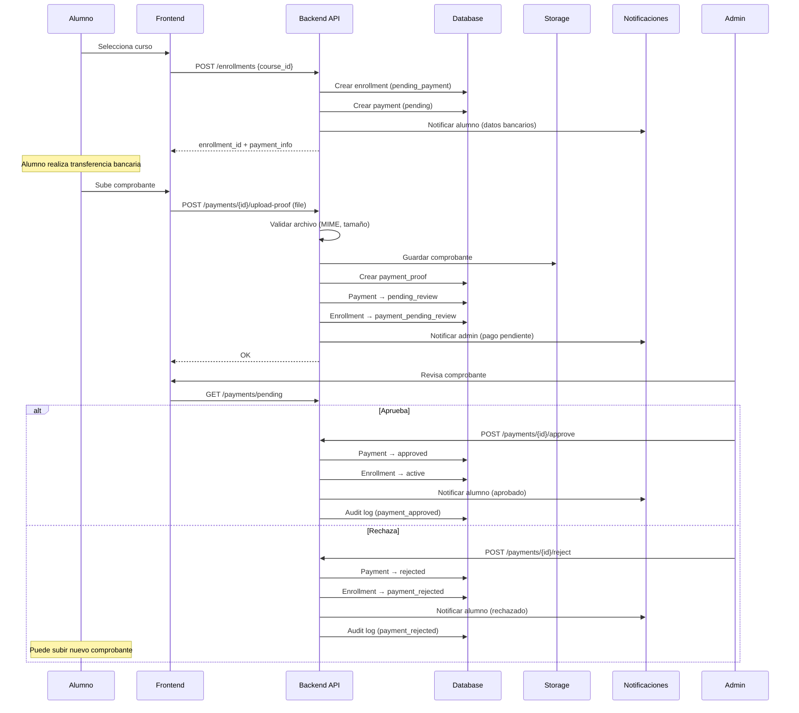
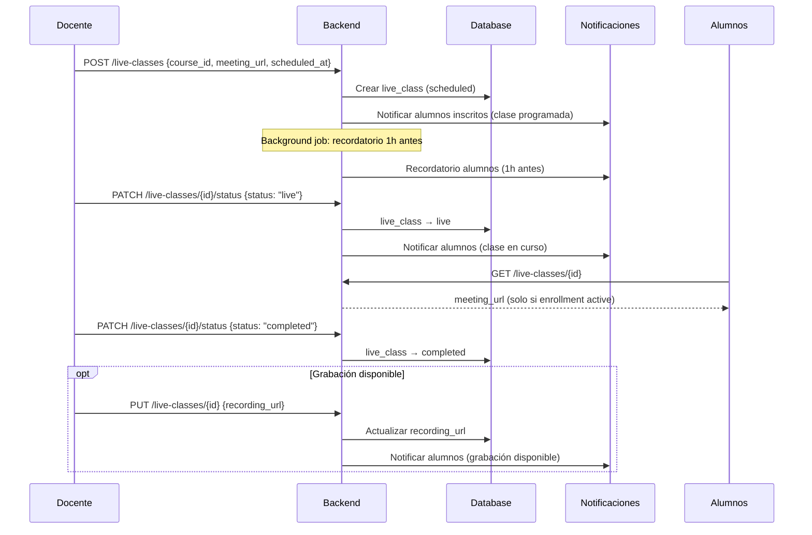
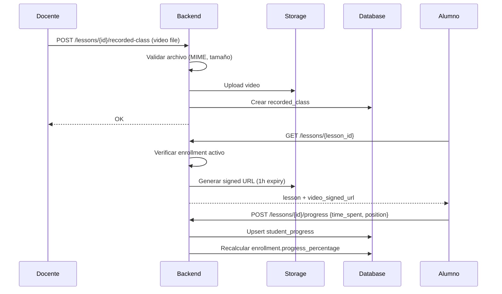
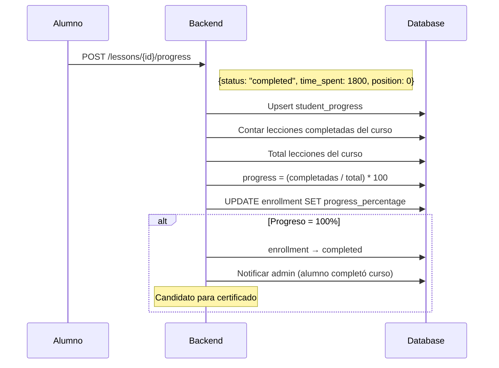
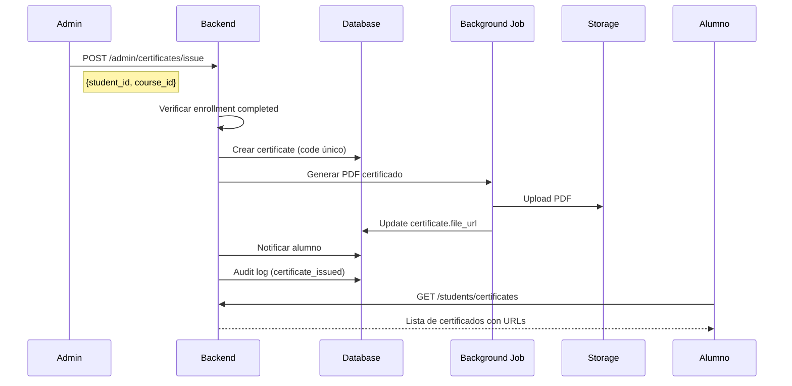

# 🔄 Flujos de Negocio — CodeAcademy Pro

## 1. Flujo de Inscripción + Pago Manual

> **Implementación actual (2026-09-11).** El diagrama describe el diseño previsto; lo que
> hace el código hoy es:
>
> 1. El alumno **no** publica `/enrollments`: sube el comprobante con
>    `POST /payments/submit-proof` (curso + plan + archivo) y nace un `payments` en
>    `pending`/`pending_review`. Todavía **no hay inscripción**, así que el curso no
>    aparece en «Mis Cursos»: sólo el pago, como *pendiente de confirmación*.
> 2. Al aprobar (`POST /payments/{id}/approve`) se crea la inscripción **siempre**:
>    - con clase y cupo → `enrollments.status = active` y `course_class_id` asignado;
>    - sin clase con cupo → `enrollments.status = payment_approved` con `course_class_id`
>      NULL y el pago en `approved_pending_class`. El alumno ya ve el curso con el aviso
>      *en espera de asignación de clase*.
> 3. `POST /payments/{id}/assign-class` **reutiliza esa misma fila** (la activa) en vez de
>    crear otra: `uq_enrollments (student_id, course_id)` admite una sola por alumno y curso.
> 4. Rechazar (`POST /payments/{id}/reject`) sólo marca `payment_rejected` la inscripción
>    **sin clase**; una inscripción `active` (el alumno ya está cursando) no se degrada al
>    rechazar un pago nuevo del mismo curso.
>
> Recordatorio: la ficha del curso sólo es visible para el alumno si el curso está
> `is_active` (política `courses_select`), así que un curso en borrador con pago aprobado
> todavía no se puede abrir aunque la inscripción exista.



### Estados de Inscripción
```
(subir comprobante) → payment_pending_review
      ↓ aprobar sin clase con cupo        ↓ aprobar con clase y cupo
   payment_approved ──assign-class──→ active → completed
                                        ↘ cancelled (desde activo o en espera)
      ↓ rechazar (sólo si no hay clase)
   payment_rejected ──nuevo comprobante──→ payment_pending_review
```

---

## 2. Flujo de Clases en Vivo



---

## 3. Flujo de Clases Grabadas



### Acceso a Videos
- Solo alumnos con enrollment `active`
- URLs pre-firmadas con expiración de 1 hora
- No se expone la URL directa del storage
- Tracking de progreso por cada lección

---

## 4. Flujo de Progreso del Alumno



### Cálculo de Progreso
```
progress_percentage = (lecciones_completed / total_lecciones_curso) * 100
```

- Se recalcula en cada actualización de progreso
- Se almacena en `enrollments.progress_percentage` (desnormalización)
- Dashboard muestra barra de progreso desde este campo

> **Estado real (2026-09-11):** la fórmula de arriba **no** está implementada. Hoy
> el progreso es un porcentaje que el docente de la clase escribe a mano
> (`PATCH /course-classes/{class_id}/students/{student_id}/progress`, 0-100) y el
> alumno lo lee (`GET /students/me/progress`). No existe `student_progress` ni
> seguimiento por lección, así que no hay nada que recalcular; al llegar a 100 se
> sella `enrollments.completed_at` (y se limpia si el porcentaje baja). La
> automatización está pendiente en el Sprint 3 del `ROADMAP.md`.

---

## 5. Sistema de Reputación de Alumnos

### Componentes

| Componente | Quién otorga | Descripción |
|------------|-------------|-------------|
| **Estrellas** (0-5) | Docente | Calificación por curso |
| **Score** (0-100) | Docente | Nota numérica |
| **Destacado** | Docente | Alumno sobresale en un curso |
| **Listo para evaluación** | Docente | Preparado para evaluación externa |

### Flujo de calificación
```
Docente → POST /teachers/students/{id}/rate
  → { course_id, score: 95, stars: 5, feedback: "Excelente trabajo" }
  → DB: Upsert student_ratings
  → Notificar alumno

Docente → POST /teachers/students/{id}/highlight
  → { course_id, type: "outstanding", notes: "..." }
  → DB: Insert student_highlights
  → Notificar alumno + admin
```

### Perfil de reputación del alumno
```json
{
  "total_stars": 23,
  "avg_score": 92.5,
  "courses_completed": 5,
  "certificates": 4,
  "is_outstanding_in": ["Python Avanzado", "React"],
  "ready_for_evaluation_in": ["Python Avanzado"]
}
```

---

## 6. Flujo de Certificados



---

## 7. Flujo de Notificaciones

### Tipos de notificación
| Tipo | Trigger | Destinatario |
|------|---------|-------------|
| `payment_pending` | Alumno sube comprobante | Admin |
| `payment_approved` | Admin aprueba pago | Alumno |
| `payment_rejected` | Admin rechaza pago | Alumno |
| `enrollment_confirmed` | Pago aprobado | Alumno |
| `live_class_scheduled` | Docente crea clase | Alumnos del curso |
| `live_class_reminder` | 1h antes de clase | Alumnos del curso |
| `live_class_started` | Docente inicia clase | Alumnos del curso |
| `certificate_issued` | Admin emite certificado | Alumno |
| `student_highlighted` | Docente marca destacado | Alumno |
| `new_review` | Alumno deja reseña | Docente |

### Canales
1. **In-app** (siempre): Tabla `notifications`, visible en frontend
2. **Email** (configurable): Via `email_queue` + background job
